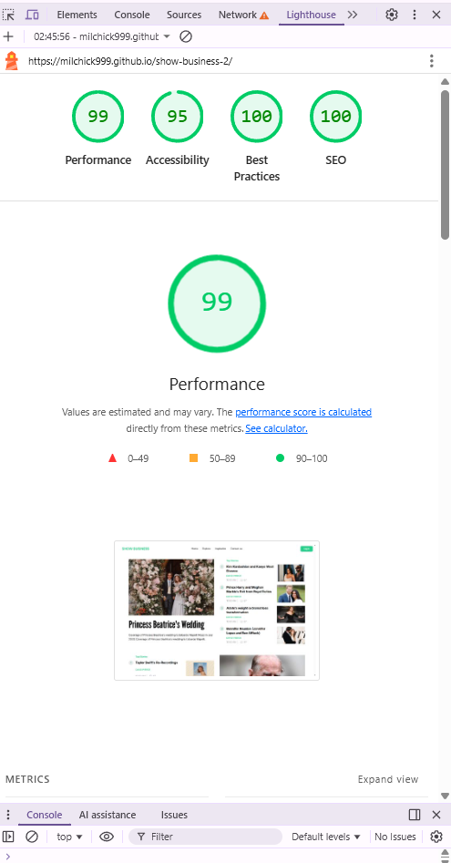
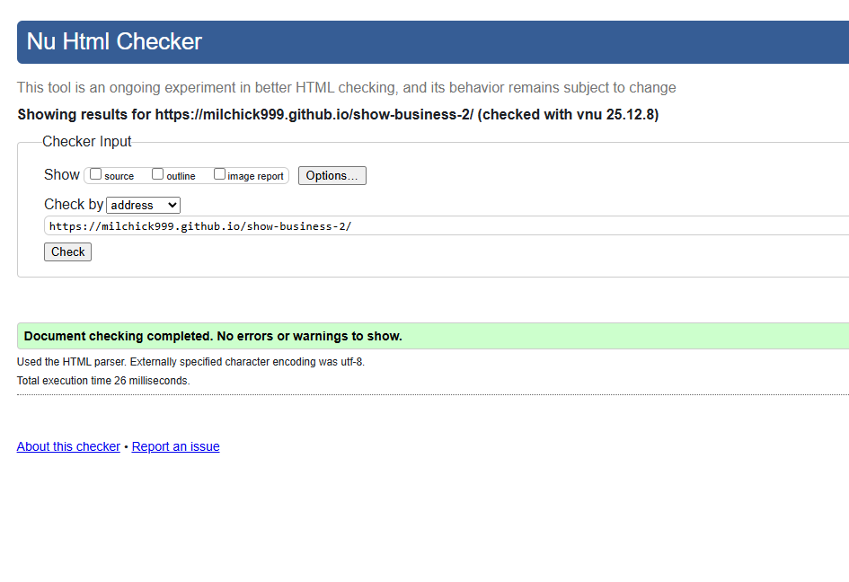
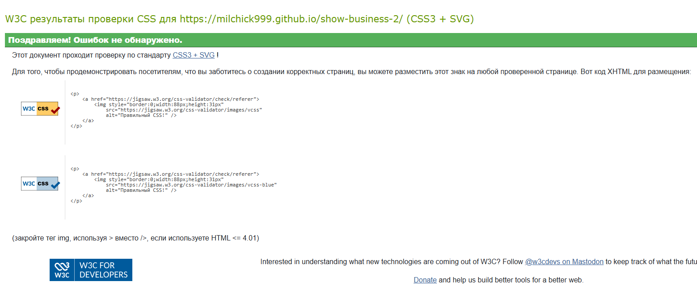
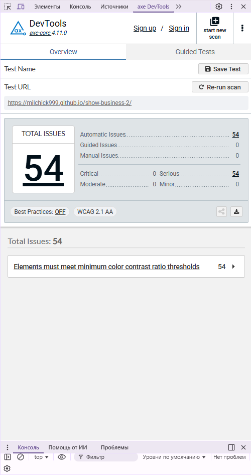
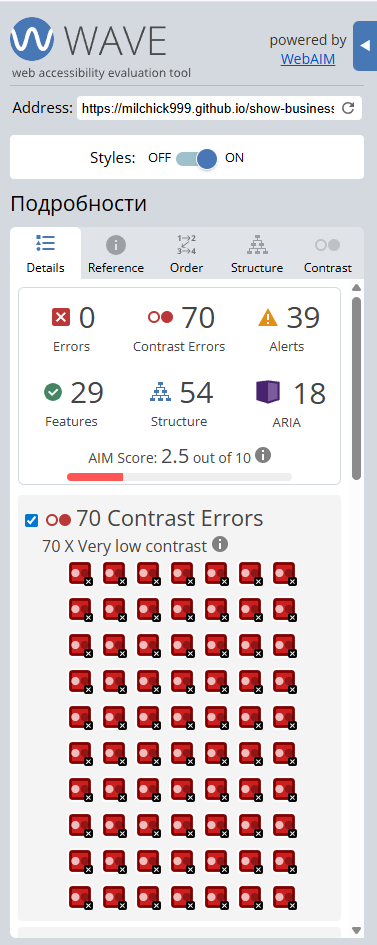

# NEWS LANDING PAGE

Landing page based on a design layout with the responsive styles.

## About the Project

One-page news website built from a design mockup, featuring:

- Semantic HTML5 markup
- Pure CSS styling using the BEM methodology.
- Minimal JavaScript (burger menu functionality)
- Modern image formats (WebP, AVIF)
- Responsive layout (mobile, tablet, desktop)
- Pixel-perfect implementation

## Technologies

- HTML5
- CSS3
- Vanilla JavaScript

## How to Run Locally

You can open the project in two ways:

- Open the `index.html` file directly in your browser
- Or run it via **Live Server** in your code editor

## Deployment

GitHub Pages:  
https://milchick999.github.io/show-business-2/

## Quality Checks Screenshots

### Lighthouse

### HTML / CSS Validation

### Accessibility (Axe / WAVE)

## Project Structure

/project-root   
├── index.html  
├── styles.css  
├── script.js   
├── /images     
├── /icons  
├── /fonts    
└── /screenshots